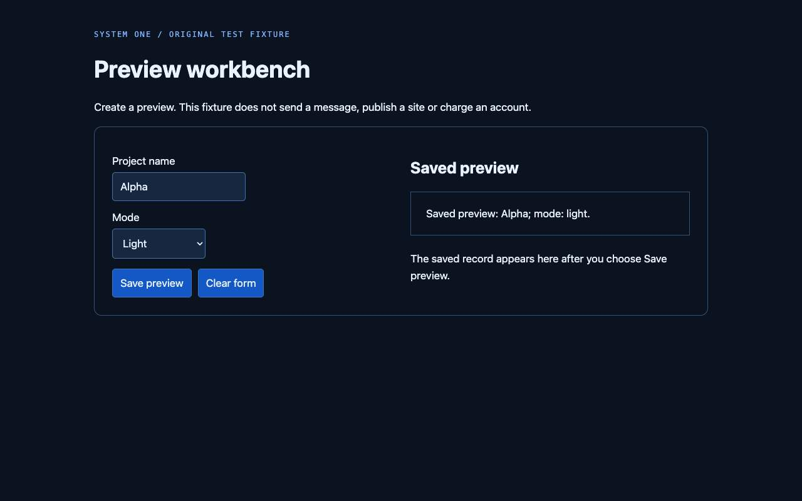

# Browser companion first diagnostic

The shared-state rerun reached the correct saved record on four of six original
browser tasks. Two stopped for uncertainty. A deterministic script completed all
six. This is a development diagnostic of an opt-in preview, not evidence of general
browser reliability or lower complete-agent cost.

## What we ran

The [six cases](../../benchmarks/browser-companion/cases.json) and
[original fixture](../../benchmarks/browser-companion/fixture.html) were committed
before live calls at `22539ac`. Each task specifies a project name, mode and initial
form values. We score the fixture server's saved record and require exactly one
write. The model's completion signal is not the verifier.

Each arm uses a fresh Chrome profile. Order alternates by task. The known script uses
exact fixture IDs and skips fields that already match. The Jev arm uses observed
controls and the public companion through System One Cloud and Vercel AI Gateway,
model `typesafe-ai/jev`. All runs used a 0.8 operational probability threshold,
seven-step limit and no automatic retry. The threshold is not calibrated accuracy.

The clock includes observations, engine calls, actions, the final screenshot and
server-record scoring. It excludes browser startup and navigation, which are
reported separately, and excludes host-agent reasoning and final visual review.
One warm local machine and network path do not represent other users.

## First run and correction

[The first run](first-run-2026-09-20.json) used companion commit `f707f52`.
It reached one correct saved record in six attempts. Two attempts hit service errors.
Most other attempts stopped for uncertainty. The successful saved record also ended
at an uncertainty stop. Keeping outcome scoring separate from stop reasons matters.

Inspection found that current field values existed only in each target question's
candidate descriptions. The operation question lacked that shared state. We added
all current control values to the shared input and made target questions independent
of another question's unknown answer. The correction is companion commit `5b733ca`.
The [changed-code rerun](shared-state-rerun-2026-09-20.json) uses the same cases, so it
is a development result. It is not held out. We did not lower the threshold.

| Measure | First Jev run | Shared-state rerun | Known script in rerun |
| --- | ---: | ---: | ---: |
| Correct saved record, exactly one write | 1/6 | 4/6 | 6/6 |
| Provider attempts | 10 | 15 | 0 |
| Service errors | 2 | 0 | 0 |
| Reported input tokens on returned answers | 8,903 | 19,670 | 0 |
| Reported output tokens on returned answers | 1,396 | 2,615 | 0 |
| Median of all task attempt times | 897.5ms | 1,095ms | 130.5ms |
| Median engine receipt latency | 317ms | 323ms | Not applicable |

The first run has no token totals for its two failed calls. The cloud account counted
all ten provider attempts. Lower all-attempt latency can result from stopping before
completing a task. It should not be read as a speed improvement. Medians use the mean
of the two central values. Six tasks do not support a useful tail-latency claim.

The rerun passed new-light, keep-mode, prefilled and replace-name. New-contrast and
change-mode stopped for uncertainty. The agent would have to inspect those screens
and finish the task. That work is not measured here. No API dollar saving or fixed
subscription saving is claimed. The known workflow is faster without a model.

All twelve final Jev screenshots accompany the raw JSON, including stopped attempts.
For example, this is the rerun's successful Alpha task:

## What changes next

Keep one-step advice and agent-visible stops. Next, freeze an unfamiliar multi-page
suite with filters, item selection and varied labels. Compare the same main agent
with and without the companion, count every returned-to-agent turn, and independently
verify outcomes. Include loading, duplicate controls and adversarial page text.

A noVNC or Mac adapter requires its own observation and execution tests. These HTML
fixtures are not evidence that the companion can interpret pixels or control desktop
apps. The broader [browser-control test plan](../../theses/browser-control.md)
tracks the proposed study. Live runs are explicit and never part of CI.
